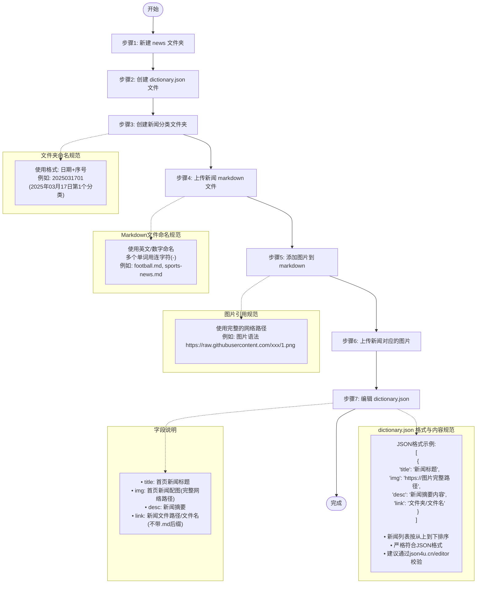

# News 操作说明

## 仓库目录结构示例

```text
official-web-data/
├── news/
│   ├── dictionary.json  # 新闻索引文件
│   │
│   ├── 2025031701/      # 第一个新闻分类文件夹
│   │   ├── football.md  # 足球新闻
│   │   ├── city.md      # 城市新闻
│   │   ├── football.jpg # 足球新闻图片
│   │   └── city.png     # 城市新闻图片
│   │
│   └── 2025031702/      # 第二个新闻分类文件夹
│       ├── tech-news.md # 科技新闻
│       └── tech.jpg     # 科技新闻图片
```

## 操作步骤




## dictionary.json-结构示例

```json
[
    {
        "title": "又一个千万人口大市诞生了",
        "img": "https://raw.githubusercontent.com/naughtyJun/book/refs/heads/main/250309/3.png",
        "desc": "3月19日，安徽省统计局发布数据，合肥市常住人口突破1000万，成为中国第18座常住人口破千万的城市。",
        "link": "250309/1" // 不需要带文件名的后缀 ".md"
    },
    {
        "title": "国足，被“抬进”世界杯？",
        "img": "https://raw.githubusercontent.com/naughtyJun/book/refs/heads/main/250309/1.webp",
        "desc": "在近日举行的国际足联理事会会议即将结束时，来自乌拉圭的理事会成员提出了一项建议：2030年世界杯扩军至64支球队参加。",
        "link": "250309/football" // 不需要带文件名的后缀 ".md"
    },
    {
        "title": "苏州再发楼市新政",
        "img": "https://raw.githubusercontent.com/naughtyJun/book/refs/heads/main/250307/2.jpeg",
        "desc": "3月10日，苏州官方发布消息，当地住建局和金融部门出台了“三低一宽”房贷政策，叠加人才房票政策，进一步降低购房门槛，助力青年人、新市民购房置业。上海易居房地产研究院",
        "link": "250309/city" // 不需要带文件名的后缀 ".md"
    }
]
```